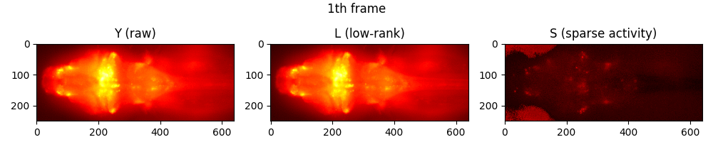
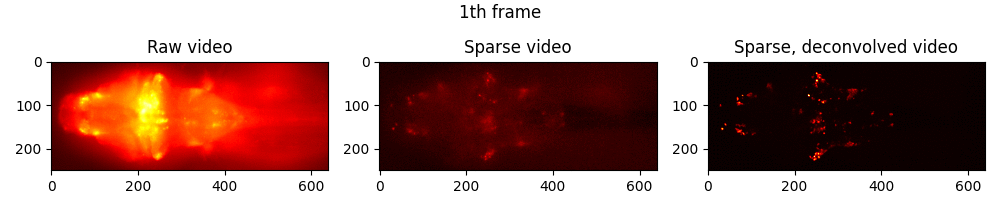

<h2 align="center">3DM: Deep decomposition and deconvolution microscopy</h2>

<p align="center">

</p>
<h6 align="center">Demo video acquired using 3DM.

 Compression is applied, portion of video is shown due to the file size. [Supplementary video 1](TODO) is the video before compression.
 </h6>


## [Paper](TODO)

Official source codes for "3DM: Deep decomposition and deconvolution microscopy", Optics Express.

**ABSTRACT**

## Requirements

```markdown
python==3.7.6
torch==1.5.0
skimage==0.16.2
```

## Demo: BEAR + Deconvolution with pretrained weight
**For more detail about BEAR which does unsupervised low-rank and sparse decomposition, please refer to our previous paper. [[PAPER]](https://arxiv.org/abs/2108.01665)[[Code and dataset]](https://github.com/NICALab/BEAR)**

There are videos saved in this notebook, where they are not visible if you simply view the notebook in github.
One way to view all things in the notebook is opening it with VS Code.

Executing shell (download + Notebook) takes approximately 10 minutes, but may differ to your network connection and computing power.
```bash
sh ./run_jupyter.sh
```
**This notebook lets you:**
- Download a portion (t=1~50, size=1.5GB) of calcium imaging data acquired with our wide-field microscope. Note that the number of timeframes of whole data we used was 1260 with 4.2VPS.
- Do unsupervised low rank and sparse decomposition using BEAR.
- Load the pretrained 3-D deconvolution network.
- Do deconvolution for each 50 sparse volumes.
- Visualize the results.

**Followings are visualization results in the notebook.**

<p align="center">

</p>
<h6 align="center">Unsupervised low rank and sparse decomposition using BEAR.

 Maximum intensity projection of videos.
 </h6>

<p align="center">

</p>
<h6 align="center">3-D Deconvolution using pretrained network.

 Maximum intensity projection of videos.
 Finally, from raw video acquired using our wide-field microscope, we acquired sparse, deconvolved video!
 </h6>

## Train
The following command starts training the 3-D deconvolution network:
```bash
python codes/train.py
```

## Test
The following commands do deconvolution after loading the pretrained weight.
```markdown
python codes/eval_simulation.py --exp_name 3DM --epoch 26000
python codes/eval_3DM_video.py --exp_name 3DM --epoch 26000
```
- `eval_simulation.py` do deconvolution for simulated wide-field data. (See Section 3.1)
- `eval_3DM_video.py` do deconvolution for wide-field data acquired with our microscope. (See Section 3.2)


## Citation
**TODO**
```markdown
@article{cho2021deep,
  title={3DM: Deep decomposition and deconvolution microscopy},
}
```
