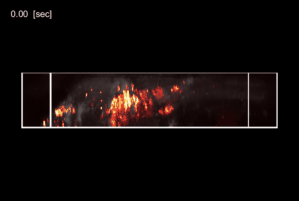

<h2 align="center">3DM: Deep decomposition and deconvolution microscopy</h2>

<p align="center">

</p>
<h6 align="center">Demo video acquired using 3DM.

 Significant compression is applied. [Supplementary video 1](TODO) is the video before compression.
 </h6>


## [Paper](TODO)

Official source codes for "3DM: Deep decomposition and deconvolution microscopy", Optics Express.

**ABSTRACT**

## Requirements

```markdown
python==3.7.6
torch==1.5.0
skimage==0.16.2
```

## Demo: BEAR + Deconvolution with pretrained weight
```bash
./run_jupyter.sh
```
This notebook lets you:
- Download a portion (t=1~50, size=**TODO**) of calcium imaging data acquired with our wide-field microscope.
- Do unsupervised low rank and sparse decomposition using BEAR.
- Load the pretrained 3-D deconvolution network.
- Do deconvolution for each 50 sparse volumes.
- Visualize the results.

## Train
The following command starts training the 3-D deconvolution network:
```bash
python codes/train.py
```

## Test
The following commands do deconvolution after loading the pretrained weight.
```markdown
python codes/eval_simulation.py --exp_name 3DM --epoch 26000
python codes/eval_3DM_video.py --exp_name 3DM --epoch 26000
```
- `eval_simulation.py` do deconvolution for simulated wide-field data. (See Section 3.1)
- `eval_3DM_video.py` do deconvolution for wide-field data acquired with our microscope. (See Section 3.2)


## Citation
**TODO**
```markdown
@article{cho2021deep,
  title={3DM: Deep decomposition and deconvolution microscopy},
}
```